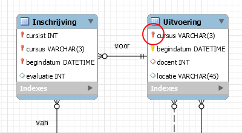

# MySQL Workbench EER Foreign key icon Fix
Fix for  in the form of a `.exe` file.

## Credits
Based on https://github.com/horeca2/MySQL-Workbench-Bug-92141-patch (also contains details for macOS users).

## Downloads
Downloads are available on the  page.

## Usage
### `mysqlwb-eer-fkicon-fix.exe`
Run the executable. Admin rights are required because MySQL Workbench is installed in `C:\Program Files\MySQL\MySQL Workbench 8.0 CE` by default.
### DIY
1. Clone the repository into a seperate directory.
2. Run `fix-mysql-erd-fk.bat` with administrator rights

## Result

